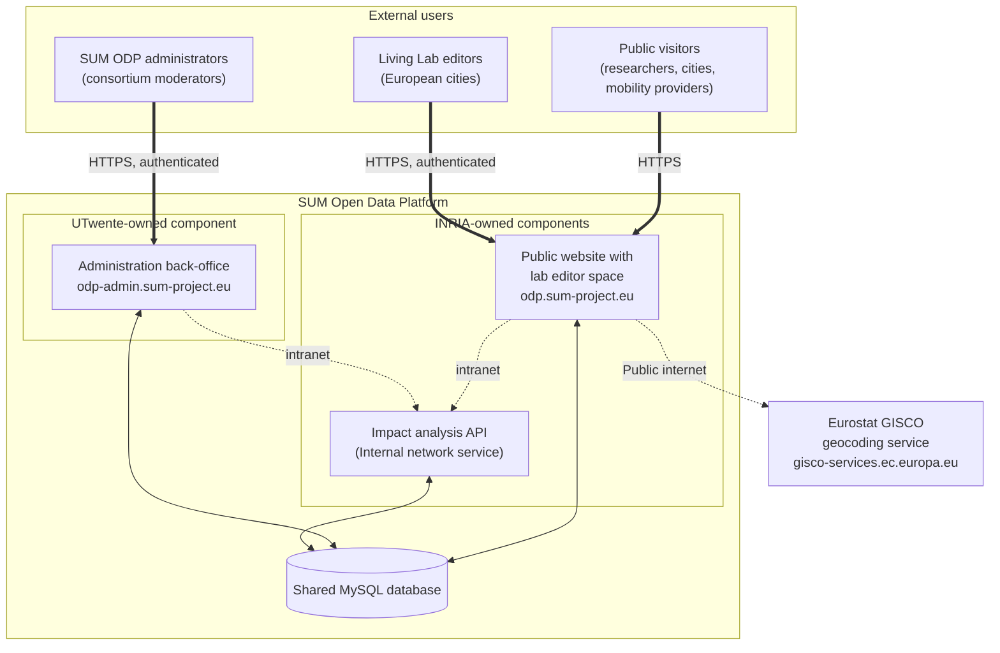

# SUM Impact Assessment Models

A library of models to analyse Living Labs' measures and KPIs, plus a FastAPI
service that exposes the results. It provides the analytic data used to study
the impact of the measures implemented in the Living Labs.

Results are intended to be displayed in a web application connected to the
SUM Open Data Platform: [sum-odp.eu](https://sum-odp.eu).

> **This repository is one of three components** that make up the production platform — see [The production platform](#the-production-platform) below.

## What it provides

- **Impact analysis** — evaluates the effects of measures on specific outcomes
  (e.g. social, economic).
- **Multi-criteria decision analysis (MCDA)** — based on the Promethee-Gaia
  methodology, compares and ranks alternatives against multiple weighted criteria.
- **A FastAPI service** to trigger these analyses as jobs and serve KPI data
  from the MySQL database.

The models require the following inputs:
- Living Labs
- New Shared Modes measures implemented by Living Labs
- Normalized variations of KPI values (before/after comparison), per Living Lab

---

## The production platform

The live product, **[odp.sum-project.eu](https://odp.sum-project.eu)**, is built from three coupled web services that share a single MySQL database and run as containers on one managed server. 

| Component | Repository | Owner | Role |
| :--- | :--- | :--- | :--- |
| **Public website + Living Lab editor space** | [INRIA/inocs-sum-odp-webapp](https://github.com/INRIA/inocs-sum-odp-webapp) | INRIA | Public consultation surface and the authenticated space where Living Lab cities submit measures and KPI results. Served at `odp.sum-project.eu`. |
| **Administration back-office** | [SUM-project/SUM-Open-data-Platform](https://github.com/SUM-project/SUM-Open-data-Platform) | UTwente | Editorial / moderation back-office used by consortium administrators. Served at `odp-admin.sum-project.eu`. |
| **Impact analysis API** *(this repo)* | [INRIA/sum-impact-assessment-models](https://github.com/INRIA/sum-impact-assessment-models) | INRIA | Runs the data analysis powering the platform's decision tools (MCDA / impact assessment). Internal network service — not publicly reachable. |

All three components read from and write to the **shared MySQL database**, which is the single source of truth for labs, measures, KPI definitions, KPI results, users, messages and impact-analysis results. The two front-facing components additionally call the Impact analysis API over an internal HTTP interface to trigger and read analysis jobs.

The platform has one external dependency: the **Eurostat GISCO** geocoding service, queried server-side by the webapp to autocomplete a Living Lab's city, country and coordinates (the editor's browser never reaches GISCO directly).



This repository is the **Impact analysis API** in the diagram above: an internal network service that reads from and writes to the shared MySQL database and is called over the intranet by the two front-facing components to trigger and read analysis jobs. It is not publicly reachable.

## Tech stack

- Python 3.13
- [pipenv](https://pipenv.pypa.io/) for dependency management
- FastAPI + Uvicorn (API)
- SQLAlchemy + PyMySQL (MySQL access)
- pandas / numpy / scikit-learn / pydecision (models)

---

## Develop locally

### 1. Clone the repository

```bash
git clone https://github.com/INRIA/sum-impact-assessment-models
cd sum-impact-assessment-models
```

### 2. Create the environment and install dependencies

On a protected/Debian system, create a virtual environment first:

```bash
python3 -m venv env && source env/bin/activate
```

Then use `pipenv` to manage the environment and dependencies:

```bash
pip install pipenv
pipenv shell
pipenv install --dev
```

### 3. Configure environment variables

Copy the template and fill in the values:

```bash
cp env.template .env
```

Point the `DB_*` variables at the **shared dev database**. Its credentials are
provided by the team — **never commit real credentials** to the repository.
See [`env.template`](env.template) for every available option.

### 4. Run the API

```bash
python run_api.py
# or
pipenv run python run_api.py
```

The API starts on `http://localhost:8000` with interactive docs at:

- Swagger UI: http://localhost:8000/docs
- ReDoc: http://localhost:8000/redoc

### 5. Run the tests

```bash
pipenv run pytest
```

### Notebooks (optional)

The `demo_*.ipynb` notebooks (e.g. [`demo_impact_analysis.ipynb`](demo_impact_analysis.ipynb),
[`demo_mcda.ipynb`](demo_mcda.ipynb)) were used during development and debugging
with the different teams to launch an analysis quickly without going through the
API. They are handy for exploring the models interactively. Run them inside the
pipenv environment (the dev dependencies include `ipykernel`).

---

## API endpoints

Authenticated endpoints expect the API key in a request header (see
[`env.template`](env.template)).

| Endpoint            | Auth                                    | Description                                              |
| ------------------- | --------------------------------------- | -------------------------------------------------------- |
| `GET /health`       | public                                  | Health check — verifies the API is running.              |
| `GET /kpis`         | `INTERNAL_API_KEY`                      | Retrieve all KPI definitions from the database.          |
| `/jobs/*`           | `INTERNAL_API_KEY`                      | Trigger, list and inspect analysis job runs.             |
| `/jobs` (admin)     | `ADMIN_REFRESH_API_KEY` + IP allowlist  | Admin full impact-refresh routes.                        |
| `/simulation/*`     | `INTERNAL_API_KEY`                      | Simulation endpoints — **disabled when `ENV=production`**. |

Example:

```bash
# Public health check
curl http://localhost:8000/health
```

Explore the full, always-up-to-date contract at `/docs`.

---

## Dependency management

The project uses `pipenv`, but Docker builds install from `requirements.txt`.
After changing dependencies, regenerate it and commit both lockfiles:

```bash
pipenv install <package-name>
pipenv requirements > requirements.txt
git add Pipfile.lock requirements.txt
git commit -m "Add <package-name> dependency"
```

> Always regenerate `requirements.txt` after modifying dependencies, or Docker
> builds will fall out of sync.

---

## Versioning & release

The image version comes from [`src/sum_impact_assessment/__version__.py`](src/sum_impact_assessment/__version__.py):

```python
__version__ = "0.1.0"  # MAJOR.MINOR.PATCH
```

To release a new version, follow [semantic versioning](https://semver.org/):

1. Bump `__version__` (MAJOR = breaking, MINOR = new feature, PATCH = fix).
2. Commit the change.
3. Run the build workflow (below).

---

## Build & publish the Docker image (CI/CD)

Images are built and published by **GitHub Actions** and pushed to the **INRIA
GitLab Container Registry**.

- Workflow: [`.github/workflows/docker-build.yml`](.github/workflows/docker-build.yml)
  — *Build and Push Docker image to GitLab Registry* (manual trigger,
  `workflow_dispatch`).
- A separate workflow ([`test.yml`](.github/workflows/test.yml)) runs the test
  suite on every push / PR to `main`.

**Image name:** `inocs-sum-odp-impact-api`

**Registry:** `registry.gitlab.inria.fr/inocs-lab/inocs-sum-docker-images/inocs-sum-odp-impact-api`
([container registry](https://gitlab.inria.fr/inocs-lab/inocs-sum-docker-images/container_registry/4463))

### Required GitHub configuration

Set these under **Settings → Secrets and variables → Actions**:

**Secrets**
- `GITLAB_REGISTRY` — `registry.gitlab.inria.fr`
- `GITLAB_USER` — GitLab (deploy) token username
- `GITLAB_PASSWORD` — GitLab (deploy) token / access token

**Variables**
- `GITLAB_PROJECT_PATH` — `inocs-lab/inocs-sum-docker-images`

### Run the workflow

1. Go to the **Actions** tab.
2. Select **Build and Push Docker image to GitLab Registry**.
3. **Run workflow** and pick the branch.

The workflow runs the tests, extracts the version, then builds and pushes two tags:

- `…/inocs-sum-odp-impact-api:<version>` (e.g. `:0.1.0`)
- `…/inocs-sum-odp-impact-api:latest`

### Build & run locally

```bash
# Build
docker build -t inocs-sum-odp-impact-api:local .

# Run
docker run -p 8000:8000 \
  -e DB_HOST=host.docker.internal \
  -e DB_PORT=3306 \
  -e DB_USER=your_user \
  -e DB_PASSWORD=your_password \
  -e DB_NAME=sum_odp \
  -e INTERNAL_API_KEY=your_key \
  inocs-sum-odp-impact-api:local

curl http://localhost:8000/health
```

### Pull the published image

```bash
docker login registry.gitlab.inria.fr
docker pull registry.gitlab.inria.fr/inocs-lab/inocs-sum-docker-images/inocs-sum-odp-impact-api:latest
```

### Image details

- Base: `python:3.13-slim`, multi-stage build for a small image.
- Runs as a non-root user (`appuser`).
- Exposes port `8000` and defines a `HEALTHCHECK` on `/health`.
- All configuration is via environment variables — see [`env.template`](env.template).

---

## Deploy

The published image is self-contained: pull it from the registry and run it with
the required environment variables (`DB_*`, `INTERNAL_API_KEY`,
`ADMIN_REFRESH_API_KEY`, `ADMIN_REFRESH_ALLOWED_IPS`, `ENV`, `LOG_*`). Set
`ENV=production` to disable the simulation endpoints.

Any container platform works (plain `docker run`, Compose, Kubernetes, …). The
generic flow is:

1. Configure the platform with credentials for the GitLab registry.
2. Point the deployment at `registry.gitlab.inria.fr/inocs-lab/inocs-sum-docker-images/inocs-sum-odp-impact-api:latest`
   (or a pinned `:<version>`).
3. Provide the environment variables above.
4. Expose the container's port `8000`.

> **Current setup:** the service is deployed with **CapRover**, using the
> "Deploy from image name" method pointed at the registry image, with the
> environment variables configured in the CapRover app. This is noted for
> context only — the image is platform-agnostic, so migrating to another tool
> only means reproducing the steps above.

---

## License

See [LICENSE](LICENSE).
