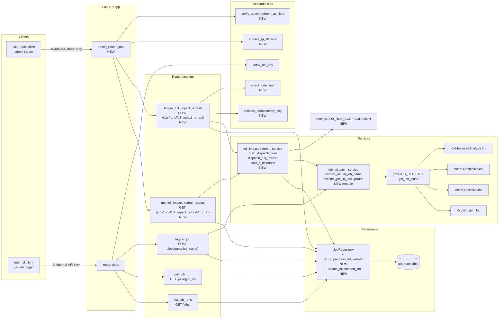
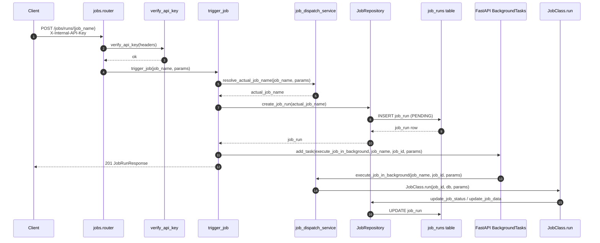
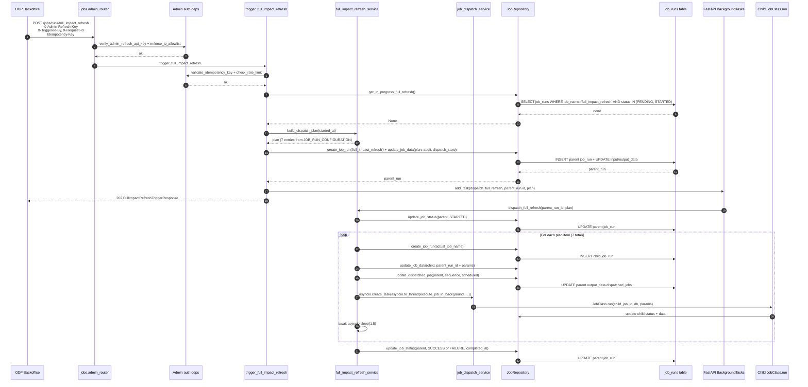
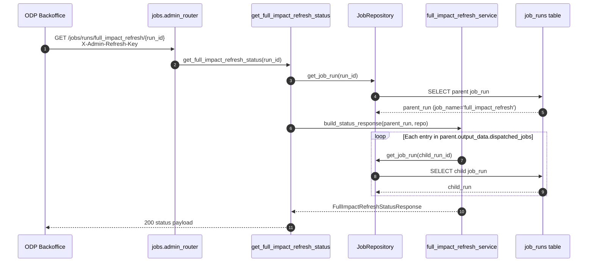
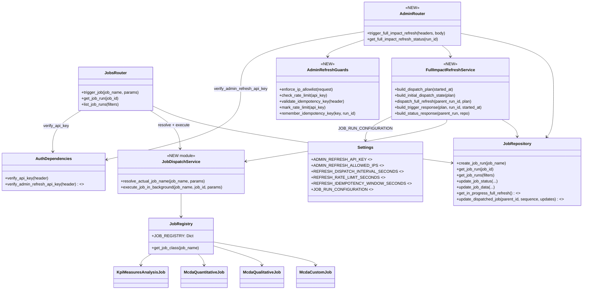
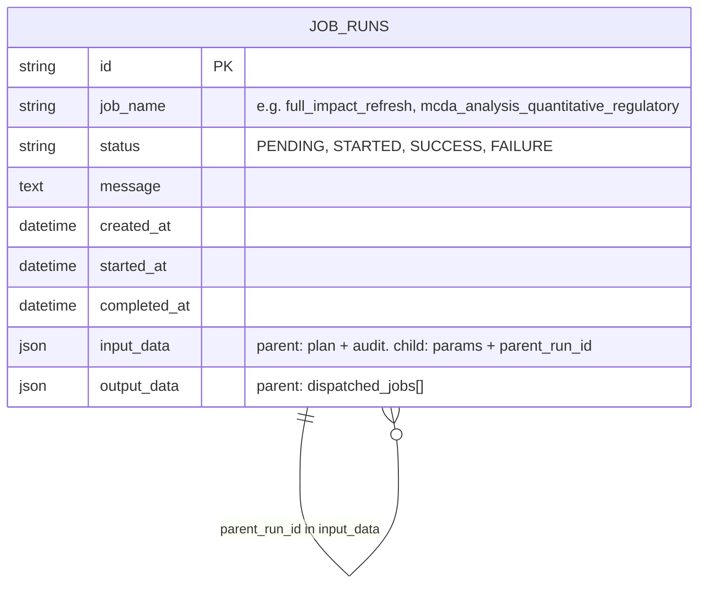

# Admin Refresh All — Architecture Docs

Visual overview of the jobs API after the admin refresh feature was added. Shows the existing per-job route, the new admin refresh route, the shared services they reuse, and how a single admin trigger fans out into seven child job runs.

## 1. Component overview

Highlights what is reused vs. newly introduced. New components added by this feature are tagged `NEW`.

## 2. Existing per-job trigger flow

`POST /jobs/runs/{job_name}` — unchanged behavior, now using the extracted `resolve_actual_job_name` and `execute_job_in_background` helpers from `job_dispatch_service`.

## 3. Admin full impact refresh flow

`POST /jobs/runs/full_impact_refresh` — NEW. One admin call creates one parent `job_run` and seven child `job_run` rows, dispatched 1.5 s apart.

## 4. Status polling flow

`GET /jobs/runs/full_impact_refresh/{run_id}` — NEW. Reads the parent `job_run` and joins the linked child rows on the fly to surface the latest status of each dispatched job.

## 5. Class-level interactions

How the new modules collaborate with the existing job classes and repository. Reuse is intentional: the admin orchestration calls the same dispatch helpers as the per-job route.

## 6. Persistence model

Both flows use the same `job_runs` table. The parent refresh row tracks the orchestration; child rows are normal job runs linked back via `input_data.parent_run_id`.

